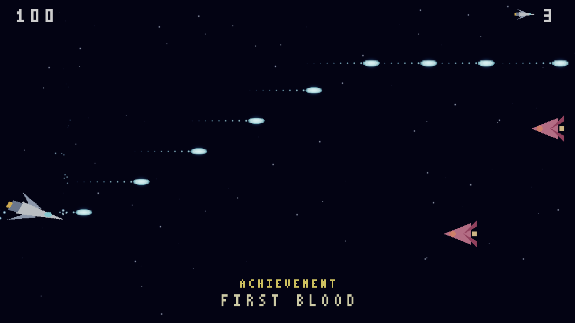

# like-nes

English · [Русский](README.ru.md)

A 2D game engine in C++20, built for games that have to run well rather than games that are quick
to start — the kind of title that lives or dies on frame time, load time and disk size. It is an
engine only: a factory for assembling a game, with no built-in music or art editors.



*The sample game, rendered by the engine itself — `game_sidescroller --demo <dir> --frames 240`
writes the same frames headlessly, which is how this one was taken.*

## What makes it different

- **Determinism is a property, not an aspiration.** The simulation is checked against golden
  hashes, and the same hash is required in Debug and in Release: a difference between optimisation
  levels in integer arithmetic is undefined behaviour, not "rounding". The same golden holds across
  operating systems and compilers, which is what makes deterministic netcode (rollback with a
  replay stream) possible at all.
- **Optimisation is architectural.** Assets are baked into a bundle ahead of time — byte-for-byte
  reproducibly, which is why third-party dependencies are pinned per commit and never patched.
  Rendering goes through WebGPU (wgpu-native): Metal on macOS, Vulkan on Linux, DX12 on Windows.
- **Free, with no strings.** `MIT OR Apache-2.0`, at your option. No royalties, no revenue
  thresholds, no commercial-use restrictions; games built with it belong entirely to their authors
  and may ship under any terms, including proprietary ones.
- **Three desktop OSes are one product.** Every gate runs on macOS, Linux and Windows in CI, and
  the platform-specific code is confined to a named seam rather than sprinkled through the tree.

## Status

**In development. There is no release yet.** Of the 22 design specs on the roadmap, 17 are closed
with an accepted architecture decision record; the rest are in progress. The public API changes
without notice, and it will keep changing until the first tagged release.

What does exist and is exercised by gates on all three OSes: the ECS core and the fixed tick, the
asset baker and bundle format, input with rebinding, 2D physics, the character controller and
tilemaps, sprites, animation, camera and particles, materials and shaders, audio, plugins (native
and WebAssembly), achievements, hot-reload, the editor shell, and deterministic networking.

## Quick start

```sh
git clone https://github.com/n0sfer666/like-nes.git
cd like-nes
cmake -S . -B build -G Ninja -DCMAKE_BUILD_TYPE=Release
cmake --build build
./build/editor_shell          # Windows: build\editor_shell.exe
```

On Windows, run that from an *x64 Native Tools Command Prompt for VS* — a plain shell has no
`cl.exe`, and the 32-bit developer prompt is refused on purpose. What each OS needs installed
first, and what a failure looks like, is in
[getting started](docs/en/getting-started/prerequisites.md).

## Documentation

- [Documentation index](docs/en/index.md) — including an honest list of what is not written yet.
- [Prerequisites](docs/en/getting-started/prerequisites.md) ·
  [Build](docs/en/getting-started/build.md) ·
  [First run](docs/en/getting-started/first-run.md)
- [`CONTRIBUTING.md`](CONTRIBUTING.md) — branches, DCO sign-off, what to run before a PR.

Design specs, architecture decision records and working notes live in [`.context/`](.context/).
They are development material — the documentation above does not assume you have read them.

## License

Dual-licensed under **MIT OR Apache-2.0**, at your option:
[`LICENSE-MIT`](LICENSE-MIT), [`LICENSE-APACHE`](LICENSE-APACHE), summary in [`LICENSE`](LICENSE).

The engine links third-party libraries that remain under their own — all permissive — licenses;
the inventory is [`THIRD-PARTY.md`](THIRD-PARTY.md) and the notices that must ship with a binary
are `THIRD-PARTY-NOTICES*.txt`. The packaging step copies all of them into the release package for
you.

Contributions are accepted under the [Developer Certificate of Origin](https://developercertificate.org/),
not a CLA: you keep your copyright, and the project cannot relicense your work out from under you.
